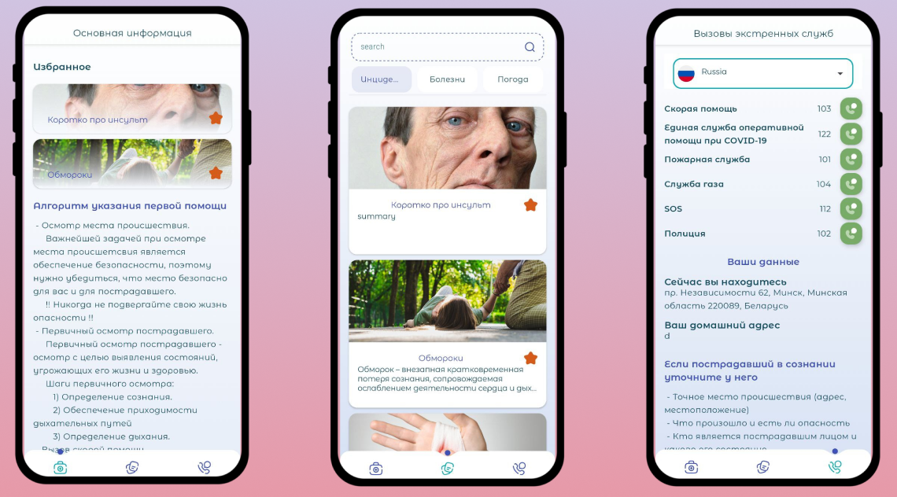

Emergency
=========

Emergency App is a smart and reliable app that helps you stay safe and informed in any emergency situation. Whether it's a natural disaster, a medical emergency, or a personal crisis, Emergency App can connect you with the right people and resources to get the help you need.

## APK / BUILD
APK - [Debug v1.0](app/debug/poi-debug.apk)

## Architecture
This application follows the classic SOLID based clean architecture approach. This approach differs from
[official architecture guidance](https://developer.android.com/topic/architecture), but it is actively used by many developers.
With this approach, the amount of boilerplate code increases, in favor of standardization and scalability.

## Features
- MVVM
- Volley
- Jetpack Datastore
- Firebase Firestore
- Firebase Cloud Storage
- Firebase Auth
- Room
- WorkManager for notifications
- Hilt
- Flow
- Coroutines

## Screenshots
